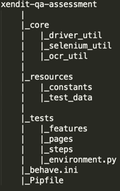

## Tools & Technology
>Programming Language: Python 3.9
>
>Web Driver: Selenium
>
>BDD: Behave
>
>OCR: gpyocr
>
>Dependencies management: Pipfile
>
>Design pattern: POM

## Download a Framework
Automation Test Framework: https://github.com/phatle0991/xendit-qa-assessment

Manual Test Case: https://docs.google.com/spreadsheets/d/1NK6iVLWKT7geDorIgjw6jwL3UrnfnkFnV72fvD_iAgY/edit?usp=sharing

## Framework Architecture

**core:** Core Framework will be developed here

>**core/driver_util:** 
>- initialize Web Driver (we support initialize multiple Driver, separately by key)
>- get Web Driver
>- Web Driver actions: Close Driver, Open URL, Switch Driver, get Page Source, Take Screen Shot

>**core/selenium_util:** selenium_util is an enhancement from Selenium. With this util, we can prevent flaky issue such as: Timeout, Element still not loaded

>**core/ocr_util:** Using to scan image then return text

**resources/constants:** Centralize config value, test data

**tests:** Automated test case will be developed here

>**tests/pages:** Page classes in POM, using to initialize locators and define locator actions

>**tests/steps:** Steps definitions in POM, using to define test step, assertion and mapping with BDD step by behave annotation given, when, then

>**tests/features:** BDD feature file. Using to develop BDD test scenario

>**tests/environment.py:** Setup/Teardown scripts for BDD step. We can define Setup/Teardown for each level in BDD: before_all, after_all, before_feature, after_feature, before scenario, after_scenario, before_step, after_step

**behave.ini:** Setting for Behave

**Pipfile:** Manage dependencies. To install dependencies just run below command: pipenv install (--skip-lock)

## Set up test environment
### Installation
The test framework is running against Python 3, please make sure you have Python 3.7 (or above) and Pip3 installed on your computer. Once you create a local copy from this rep. Please follow installation steps as below:

You need to install tesseract to use OCR for Canvas value scanning:
> **OS X:** brew install tesseract
> 
> **Windows:** download binary from https://github.com/UB-Mannheim/tesseract/wiki. then add pytesseract.pytesseract.tesseract_cmd = 'C:\Program Files (x86)\Tesseract-OCR\tesseract.exe' to your script.

You need to use allure command-line to resolve allure results and present test report in browsers, you can install it with Homebrew
> brew install allure

Install dependencies from Pipfile
> pip install pipenv (install pipenv if it's not installed)
> 
> pipenv install (--skip-lock)

To develop your test cases, you may choose PyCharm(Recommended!) as your IDE
> Go to Preferences > Project Interpreter > Add > Pipenv Environment > Ok
> 
> (refer https://www.jetbrains.com/help/pycharm/pipenv.html for more details)

## Writing a test
We develop Test Case following POM x BDD:
1. Develop locators in tests/pages/page_class
2. Develop step definitions in test/steps/step_class
3. Write BDD scenarios in test/features/feature_file

## Run test cases
This test framework is using Behave which supports several ways to run and select tests from the command-line.

### Run all tests
> pipenv run behave

### User define parameters
To use User define parameters, please refer to below syntax:
> pipenv run behave -D <parameter_name>=<parameter_value>

We support below user define parameters:
> screenshot: failed/passed. Take screenshot then attach into Allure Report when test step failed/passed. By default screenshot=failed.
> 
>e.g:
> pipenv run behave -D screenshot=passed

> clear_temp: True/False. Clear screenshot for OCR in the ./Temp folder. By default clear_temp=True.
> 
>e.g:
> pipenv run behave -D clear_temp=False
### Filter by tag
> pipenv run behave --tags=<tag_name> 
> 
> e.g: pipenv run behave --tags=single-operator. Behave will run scenarios having @single-operator only

## Open report
> pipenv run open_report